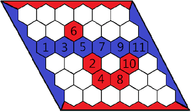

# 2013 Round B C. Hex


## Problem/题意

Given a hex game board, check its state,
* "*Impossible*": If it was impossible for two players to follow the rules and to have arrived at that game state.
* "*Red wins*": If the player playing the red stones has won.
* "*Blue wins*": If the player playing the blue stones has won.
* "*Nobody wins*": If nobody has yet won the game. Note that a game of Hex can't end without a winner!
Blue and Red both can play first,
if top and bottom are connected with red stones Red CAN win(without invalid state).
if left and right are connected with blue stones Blue CAN win(without invalid state).


给定 Hex 游戏板，判断当前状态
上下红色连通，Red可能赢
左右蓝色连通，Blue可能赢


## Analysis/分析

Invalid states:
* the difference between the numbers of blue and red stones are bigger than 1
* both blue and red win
* blue win but red stones are more
* red win but blue stones are more
* **change each stone the player can still win(there are more than one path to win)**

we use dfs check if the player can win
and do further step to check if the player can win more than once

不合法状态
* 红色蓝色石头相差超过1
* 红色蓝色都赢
* 红赢但蓝色石头多
* 蓝赢但红色石头多
* **把每个石头都去掉一遍，此玩家还能赢，(不只有一条路径可以赢)**

用 dfs 判断玩家是否能赢
再把每个石头去掉，检查是否是还能赢


## Solution/解法
```cpp
#include <bits/stdc++.h>
using namespace std;

vector<int> dx = {0, 0, 1, 1, -1, -1};
vector<int> dy = {-1, 1, -1, 0, 1, 0};
int T, n;

bool dfs(vector<string>& board, vector<vector<bool>>& vis, int x, int y, char p) {
    vis[x][y] = true;
    if (p == 'B' && y == n-1) return true;
    else if (p == 'R' && x == n-1) return true;
    for (int i = 0; i < 6; i++) {
        int nx = x + dx[i];
        int ny = y + dy[i];
        if (0 <= nx && nx < n && 0 <= ny && ny < n && board[nx][ny] == p && vis[nx][ny] == false) {
            if (dfs(board, vis, nx, ny, p)) {
                return true;
            }
        }
    }
    return false;
}
int win(vector<string>& board, char p) {
    vector<vector<bool>> vis(n, vector<bool>(n, false));
    if (p == 'B') {
        for (int i = 0; i < n; i++) {
            if (board[i][0] == p && dfs(board, vis, i, 0, p)) {
                return true;
            }
        }
    }
    else {
        for (int i = 0; i < n; i++) {
            if (board[0][i] == p && dfs(board, vis, 0, i, p)) {
                return true;
            }
        }
    }
    return false;
}

bool checkValid(vector<string>& board, char p) {
    for (int i = 0; i < n; i++) {
        for (int j = 0; j < n; j++) {
            if (board[i][j] == p) {
                board[i][j] = '.';
                if (win(board, p) == false) {
                    return true;
                }
                board[i][j] = p;
            }
        }
    }
    return false;
}

int main() {
    // freopen("c.in", "r", stdin);
    freopen("2013_B_C-large-practice.in", "r", stdin);
    freopen("2013_B_C-large-practice.out", "w", stdout);

    scanf("%d", &T);
    for (int t = 1; t <= T; t++) {
        scanf("%d", &n);
        vector<string> board(n);
        for (int i = 0; i < n; i++) {
            cin >> board[i];
        }
        int bcnt = 0, rcnt = 0;
        for (int i = 0; i < n; i++) {
            for (int j = 0; j < n; j++) {
                if (board[i][j] == 'B') bcnt++;
                else if (board[i][j] == 'R') rcnt++;
            }
        }
        if (abs(bcnt-rcnt) > 1) {
            cout << "Case #" << t << ": " << "Impossible" << endl;
            continue;
        }
        bool winBlue = win(board, 'B');
        bool winRed = win(board, 'R');
        if (winBlue && winRed) {
            cout << "Case #" << t << ": " << "Impossible" << endl;
            continue;
        }
        if ((winBlue && bcnt < rcnt) || (winRed && rcnt < bcnt)) {
            cout << "Case #" << t << ": " << "Impossible" << endl;
            continue;
        }
        if (winBlue || winRed) {
            if (!checkValid(board, winBlue ? 'B' : 'R')) {
                cout << "Case #" << t << ": " << "Impossible" << endl;
                continue;
            }
        }
        if (winBlue) {
            cout << "Case #" << t << ": " << "Blue wins" << endl;
            continue;
        }
        else if (winRed) {
            cout << "Case #" << t << ": " << "Red wins" << endl;
            continue;
        }
        cout << "Case #" << t << ": " << "Nobody wins" << endl;
    }
    return 0;
}
```